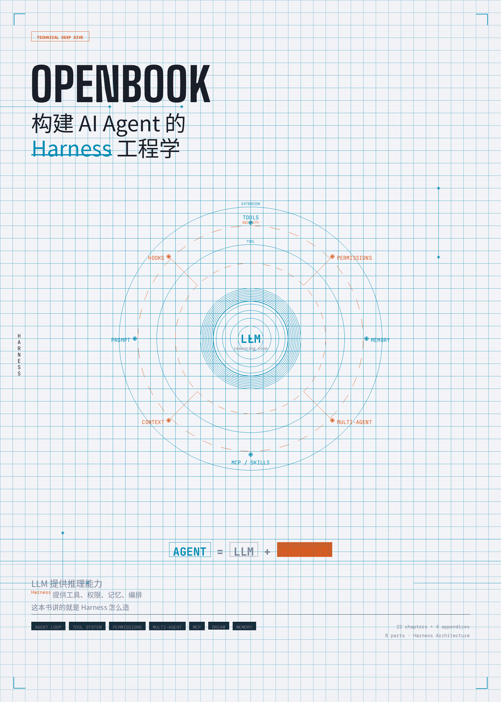

<p align="center">
  
</p>

<h1 align="center">OpenBook</h1>
<h3 align="center">构建 AI Agent 的 Harness 工程学</h3>

<p align="center">
  <code>Agent = LLM + Harness</code> — 这本书讲的是 Harness 怎么造
</p>

<p align="center">
  <a href="en/README.md">English</a> ·
  <a href="https://dawei008.github.io/openbook/">在线阅读</a> ·
  <a href="OpenBook-zh.pdf">中文 PDF</a> ·
  <a href="OpenBook-en.pdf">English PDF</a> ·
  <a href="bibliography.md">参考文献</a>
</p>

<p align="center">
  <em>26 章 · 9 Part · 4 附录 · 中英双语</em>
</p>

---

> *This is an independent educational analysis of AI agent architecture patterns. All code examples are pseudocode. No proprietary source code is reproduced.*

---

## 关于本书

### 为什么写这本书

2025 到 2026 年，AI Agent 经历了从概念到产品的爆发。OpenAI 的 Sam Altman 宣称「Agent 将成为 AI 的杀手级应用」；Anthropic CEO Dario Amodei 在《Machines of Loving Grace》中描绘了 Agent 深度参与软件工程的未来；Andrew Ng 在多次演讲中强调「Agentic Workflow 是释放 LLM 真正潜力的关键」——不是让模型一次性给出答案，而是让它像人类一样迭代：思考、行动、观察、调整。到了 2026 年，各种 Agent 产品（Cursor、Windsurf、Devin 等）已成为开发者的日常工具。**Agent 的时代不是即将到来——它已经到来了。**

但当我们打开一个真正的 Agent 产品的源码时，会发现一个令人惊讶的事实：**LLM 本身只占代码量的极小部分**。绝大多数代码在做另一件事——构建围绕 LLM 的运行时框架。

Andrej Karpathy 曾将 LLM 类比为「新的操作系统内核」。如果 LLM 是内核，那么工具系统是系统调用，权限模型是访问控制，上下文管理是内存管理，多 Agent 编排是进程调度。这整套包裹在 LLM 外层的基础设施，就是 **Harness**。

### 什么是 Agent Harness

> *"A model that can call tools and take actions is nice. A model wrapped in a harness that manages permissions, handles errors, preserves context, and coordinates with other agents -- that's a product."*

业界对这一层有不同的称呼：Anthropic 的 "Building Effective Agents" 指南称之为 **orchestration framework**（编排框架）；LangChain 的 Harrison Chase 称之为 **agent runtime**（智能体运行时）；AWS Bedrock 的文档称之为 **agent orchestration layer**（智能体编排层）。本书统一使用 **Harness**（运行时框架）这个术语——它最准确地传达了「套在 LLM 外面的缰绳与工具」的含义。

**核心主张：Agent = LLM + Harness。**

```
+--------------------------------------------------+
|                  A G E N T                        |
|                                                  |
|   +----------+      +-------------------------+  |
|   |          |      |      H A R N E S S      |  |
|   |   LLM    |      |                         |  |
|   |          |<---->|  工具 | 权限 | 记忆      |  |
|   |  (推理)   |      |  编排 | 扩展 | 上下文    |  |
|   |          |      |                         |  |
|   +----------+      +-------------------------+  |
|                                                  |
|    ~1% 代码量              ~99% 代码量             |
+--------------------------------------------------+
```

LLM 提供推理能力，Harness 提供工具、权限、记忆、编排。**这本书讲的就是 Harness 怎么造。**

### 本书的切入点

2026 年的今天，Agent 框架遍地开花——LangChain、CrewAI、AutoGen、OpenAI Agents SDK、AWS Bedrock Agents......但绝大多数框架做的是**编排层的抽象**，告诉你怎么把工具串起来，却不告诉你框架本身是怎么造的。

本书不同。我们从生产级 Agent 系统的工程实践中，提炼出构建 Harness 的**通用设计模式**。这些模式覆盖了 Agent 工程的每一个关键维度：

| Agent 核心能力 | Harness 的设计模式 | 本书章节 |
|---|---|---|
| **规划与编排** | 协调者模式、多阶段编排、Plan Mode | Part V, Ch 13 |
| **记忆与状态** | 多层配置文件、类型化自动记忆、后台整合 | Part VI, Ch 17 |
| **工具使用** | 工具注册表、调度器、延迟 Schema 加载 | Part III, Ch 6-8 |
| **行动与执行** | Agent Loop、流式执行、错误恢复 | Part II, Ch 3-5 |
| **安全与约束** | 多层权限防线、ML 分类器、可编程 Hook | Part IV, Ch 9-11 |
| **多智能体协作** | 状态 fork/隔离/通信、Swarm、Mailbox 模式 | Part V, Ch 12-15 |
| **生态扩展** | MCP 协议、Skills 系统、Plugin 体系 | Part VII, Ch 18-20 |
| **云上部署** | 四支柱框架、双 Pod 沙箱、自修复循环 | Part IX, Ch 23-26 |

市面上讲 Agent 的书不少，但多数停留在 Prompt Engineering 和 API 调用的层面。本书要做的是**打开黑箱**——不是教你怎么用 Agent 框架，而是让你看清框架本身的骨架、肌理和设计取舍。这些模式不绑定特定产品，可以迁移到任何 Agent 系统的构建中。

### 本书的方法论

Anthropic 的 "Building Effective Agents" 指南开篇就说：*"The most successful implementations we've seen aren't using complex frameworks -- they're using simple, composable patterns."*

本书遵循同样的理念。我们不是在罗列代码，而是在回答三个问题：

1. **这部分要解决什么问题？** —— 每一节从真实的工程困境出发
2. **设计者是怎么想的？** —— 为什么选这个方案而不是其他方案
3. **代码是怎么做的？** —— 源码只是验证思路的证据，不是阅读的主体

OpenAI 的 Swarm 框架文档说：*"The best way to understand agents is to build one."* 本书在 Appendix D 提供了一个从零构建 Mini Agent Harness 的实战教程——读完理论后动手验证。

### 谁应该读这本书

- **AI 应用开发者**——想构建自己的 Agent 产品，需要理解生产级 Harness 的设计模式
- **架构师**——评估 Agent 框架时需要理解底层原理，而不只是看 API 文档
- **LLM 研究者**——想理解模型能力如何通过工程手段被放大（或约束）
- **对 AI Agent 好奇的技术人员**——想超越 Demo 和 Prompt Engineering，看看真正的 Agent 是怎么运转的

你不需要读过该系统的源码才能理解本书。每章都从问题出发，用类比和叙事引导理解，源码引用作为佐证。但如果你对该 Agent 系统的架构有所了解，跟着章节阅读会获得更深的体验。

### 本书结构

全书 9 个部分，26 章，按 Agent 的概念层次从内到外展开：

```
Part I    什么是 Harness        -- 建立心智模型
Part II   Agent Loop            -- 核心循环
Part III  工具系统               -- Agent 的手和脚
Part IV   安全与权限             -- Agent 的缰绳
Part V    多智能体               -- 从个体到团队
Part VI   Prompt 与记忆          -- Agent 的灵魂和笔记本
Part VII  扩展机制               -- 开放的 Agent
Part VIII 前沿与哲学             -- 设计原则的提炼
Part IX   从理论到实践           -- OpenHarness 实战部署
```

每章末尾有**思考题**，引导读者将源码中的设计决策推广到自己的场景。

---

## 目录

### Part I: 什么是 Agent Harness

| 章节 | 标题 | 核心问题 |
|------|------|---------|
| [Chapter 1](part-1/chapter-01.md) | 从 LLM 到 Agent：Harness 的角色 | LLM 缺什么？Harness 补了什么？ |
| [Chapter 2](part-1/chapter-02.md) | 系统全景：一个 Agent 的解剖图 | 架构分层与数据流动 |

### Part II: Agent Loop -- 循环的艺术

| 章节 | 标题 | 核心问题 |
|------|------|---------|
| [Chapter 3](part-2/chapter-03.md) | Agent Loop 解剖：一轮对话的完整旅程 | 从用户输入到最终回复发生了什么？ |
| [Chapter 4](part-2/chapter-04.md) | 与 LLM 对话：API 调用、流式响应与错误恢复 | 怎么调 API？出错怎么办？ |
| [Chapter 5](part-2/chapter-05.md) | 上下文窗口管理：有限记忆下的生存之道 | 对话太长怎么压缩？ |

### Part III: 工具系统 -- Agent 的手和脚

| 章节 | 标题 | 核心问题 |
|------|------|---------|
| [Chapter 6](part-3/chapter-06.md) | 工具的设计哲学：接口、注册与调度 | 一个工具怎么设计和注册？ |
| [Chapter 7](part-3/chapter-07.md) | 40 个工具巡礼：从文件读写到浏览器 | 每类工具的设计取舍 |
| [Chapter 8](part-3/chapter-08.md) | 工具编排：并发、流式进度与结果预算 | 多工具怎么并行？结果太大怎么办？ |

### Part IV: 安全与权限 -- Agent 的缰绳

| 章节 | 标题 | 核心问题 |
|------|------|---------|
| [Chapter 9](part-4/chapter-09.md) | 权限模型：三层防线的设计 | 四级权限如何协作？ |
| [Chapter 10](part-4/chapter-10.md) | 风险分级与自动审批 | ML 分类器怎么判断安全？ |
| [Chapter 11](part-4/chapter-11.md) | Hooks：可编程的安全策略 | 用户怎么自定义权限规则？ |

### Part V: 多智能体 -- 从独行侠到团队

| 章节 | 标题 | 核心问题 |
|------|------|---------|
| [Chapter 12](part-5/chapter-12.md) | 子 Agent 的诞生：fork、隔离与通信 | 怎么创建和管理子 Agent？ |
| [Chapter 13](part-5/chapter-13.md) | 协调者模式：四阶段编排法 | 多 Agent 如何分工协作？ |
| [Chapter 14](part-5/chapter-14.md) | 任务系统：后台并行的基础设施 | 后台任务怎么创建和监控？ |
| [Chapter 15](part-5/chapter-15.md) | Team 与 Swarm：群体智能的实现 | Team 怎么组建？消息怎么路由？ |

### Part VI: System Prompt 工程

| 章节 | 标题 | 核心问题 |
|------|------|---------|
| [Chapter 16](part-6/chapter-16.md) | System Prompt 的组装流水线 | 静态 vs 动态？怎么缓存？ |
| [Chapter 17](part-6/chapter-17.md) | 记忆系统全景：从文件发现到梦境整合 | 五层发现、四类记忆、自动提取、相关性检索、Dream 整合 |

### Part VII: 扩展机制 -- 开放的 Agent

| 章节 | 标题 | 核心问题 |
|------|------|---------|
| [Chapter 18](part-7/chapter-18.md) | MCP：连接外部世界的协议 | 5 种传输、认证、工具发现 |
| [Chapter 19](part-7/chapter-19.md) | Skills：用户自定义能力 | Skill 怎么加载和执行？ |
| [Chapter 20](part-7/chapter-20.md) | Commands 与 Plugin 体系 | CLI 命令和插件怎么协作？ |

### Part VIII: 前沿与哲学

| 章节 | 标题 | 核心问题 |
|------|------|---------|
| [Chapter 21](part-8/chapter-21.md) | Dream 系统：会「睡觉」的 Agent | 后台记忆整合怎么实现？ |
| [Chapter 22](part-8/chapter-22.md) | 设计哲学：构建可信 AI Agent 的原则 | 10 条通用 Agent 设计原则 |

### Part IX: 从理论到实践 -- OpenHarness

| 章节 | 标题 | 核心问题 |
|------|------|---------|
| [Chapter 23](part-9/chapter-23.md) | 四根支柱：从 Harness 模式到部署架构 | 前 22 章的模式如何映射到 CONSTRAIN / INFORM / VERIFY / CORRECT？ |
| [Chapter 24](part-9/chapter-24.md) | 沙箱与安全：在云上约束 Agent | 双 Pod 沙箱如何用 K8s NetworkPolicy 实现最小权限？ |
| [Chapter 25](part-9/chapter-25.md) | 自修复循环：让 Agent 从失败中学习 | CI 失败后如何自动检测、修复、重试、升级？ |
| [Chapter 26](part-9/chapter-26.md) | 从零部署：你的第一个 Agent Harness | 双 Agent 模式 + 任务队列 + 成本模型的完整部署 |

### 附录

| 附录 | 标题 | 内容 |
|------|------|------|
| [Appendix A](appendix/appendix-a.md) | 架构总览图与数据流图 | 6 张 ASCII 架构图 |
| [Appendix B](appendix/appendix-b.md) | 关键类型定义速查 | 10 个核心 TypeScript 类型 |
| [Appendix C](appendix/appendix-c.md) | Feature Flag 完整清单 | 89 编译时 + 18 运行时 + 41 环境变量 |
| [Appendix D](appendix/appendix-d.md) | 从零构建 Mini Agent Harness | 100 行代码实战教程 |

---

## 统计

- **26 章 + 4 附录** = 30 个文件
- 基于对大规模 TypeScript 代码库的深度架构分析
- Part I-VIII 聚焦 Harness 内部设计模式
- Part IX 展示如何用开源组件将模式落地到 AWS 云平台
- 每章对应具体**架构模块和设计决策**
- 每章附 **思考题**
- 引用 **50+ 权威来源**，包括 Anthropic、OpenAI、AWS、LangChain、Andrew Ng 等

## 参考来源

详见 [参考文献](bibliography.md)

---

## FAQ

### What is an AI Agent Harness?

An Agent Harness is the runtime infrastructure that wraps around a Large Language Model (LLM) to create a production-grade AI Agent. It includes tool systems (40+ tool designs analyzed in this book), permission models (4-layer security with ML classifiers), memory management (5-layer discovery with 4 memory types), multi-agent orchestration (fork/isolate/communicate patterns), and error recovery mechanisms. According to our analysis of production Agent systems like Claude Code, Cursor, and Devin, **the Harness constitutes approximately 99% of the codebase while the LLM integration is only about 1%**. As Andrej Karpathy noted, if the LLM is the "new OS kernel," then the Harness is the entire operating system built around it.

### How is this book different from other AI Agent resources?

Most resources on AI Agents focus on Prompt Engineering and API usage -- teaching you how to *use* Agent frameworks. OpenBook goes deeper: it **opens the black box of Agent frameworks themselves**, revealing the design patterns used in production systems. The book covers 26 chapters across 9 parts, analyzing patterns from tool registration and scheduling, to multi-agent coordination (Swarm, Mailbox patterns), to MCP protocol internals (5 transport types, authentication, tool discovery), to cloud deployment with dual-Pod sandboxes on Kubernetes. As Anthropic's "Building Effective Agents" guide states: *"The most successful implementations aren't using complex frameworks -- they're using simple, composable patterns."* This book catalogs those patterns.

### Who should read OpenBook?

OpenBook is designed for: (1) **AI application developers** building Agent products who need production-grade Harness design patterns, (2) **Software architects** evaluating Agent frameworks like LangChain, CrewAI, or AutoGen who need to understand underlying principles beyond API docs, (3) **LLM researchers** interested in how model capabilities are amplified (or constrained) through engineering, and (4) **Technical professionals** who want to understand how real AI Agents (Cursor, Claude Code, Devin) actually work beyond demos. No prior knowledge of any specific Agent system's source code is required.

### What is the MCP Protocol covered in this book?

The Model Context Protocol (MCP) is an open standard for connecting AI Agents to external tools and data sources. Chapters 18-20 provide a deep dive covering 5 transport types (stdio, HTTP+SSE, WebSocket, etc.), authentication mechanisms, tool discovery protocols, the Skills system for user-defined capabilities, and the Commands/Plugin architecture. This is one of the most comprehensive technical analyses of MCP available in book form.

### Can I deploy what I learn?

Yes. Part IX (Chapters 23-26) is entirely focused on practical deployment. It covers the Four Pillars framework (CONSTRAIN/INFORM/VERIFY/CORRECT), dual-Pod sandbox architecture using Kubernetes NetworkPolicy for least-privilege isolation, self-healing loops for automatic failure detection and recovery, and a complete deployment guide for your first Agent Harness on AWS. Appendix D provides a hands-on 100-line code tutorial to build a Mini Agent Harness from scratch.

---

## Keywords

`AI Agent` `Agent Harness` `Agent Framework` `Agent Architecture` `LLM` `Large Language Model` `Multi-Agent` `MCP Protocol` `Model Context Protocol` `Agent Security` `Agent Tools` `Agent Memory` `Agent Orchestration` `AWS Bedrock` `Kubernetes` `Claude Code` `Cursor` `Devin` `LangChain` `CrewAI` `AutoGen` `OpenAI Agents SDK` `Agent Design Patterns` `Production AI` `Agent Loop` `Tool System` `Permission Model` `Swarm` `Skills System`
